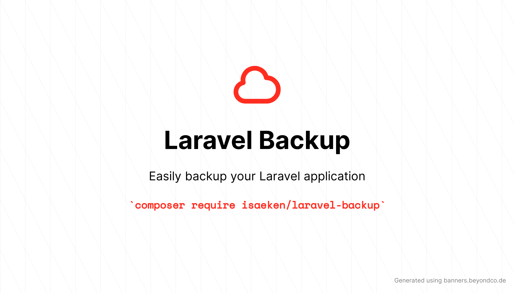

# Laravel Backup

[](https://packagist.org/packages/isaeken/laravel-backup)
[](https://github.com/isaeken/laravel-backup/actions/workflows/run-tests.yml)
[](https://github.com/isaeken/laravel-backup/actions?query=workflow%3A"Check+%26+fix+styling"+branch%3Amaster)
[](https://packagist.org/packages/isaeken/laravel-backup)

---

Advanced, Flexible and Extensible Backup Automation tool for Laravel 9

## Installation

You can install the package via composer:

```shell
composer require isaeken/laravel-backup
```

## Usage

> Work in progress do not use in production!

```shell
php artisan backup:run
php artisan backup:run --services=database,storage
php artisan backup:run --storages=local,s3,gcloud
php artisan backup:run --disable-notifications
php artisan backup:run --timeout=3
```

---

```shell
php artisan backup:list
```

```shell
output:
+---+--------------------------------------------+-------+---------------------+----------+
| # | Name                                       | Disk  |                Date |     Size |
+---+--------------------------------------------+-------+---------------------+----------+
| 1 | backup_2022-03-13-22-48-29.zip             | local | 2022-03-13 22:48:29 | 29.99 KB |
| 2 | backup_database_2022-03-13-22-48-29.sqlite | local | 2022-03-13 22:48:29 |    48 KB |
+---+--------------------------------------------+-------+---------------------+----------+
******************************************
*     Totally Used Storage: 77.99 KB     *
******************************************
```

## Testing

```shell
composer test
```

## Changelog

Please see [CHANGELOG](CHANGELOG.md) for more information on what has changed recently.

## Contributing

Please see [CONTRIBUTING](.github/CONTRIBUTING.md) for details.

## Security Vulnerabilities

Please review [our security policy](../../security/policy) on how to report security vulnerabilities.

## Credits

- [İsa Eken](https://github.com/isaeken) Founder

## License

The MIT License (MIT), Please see [License File](LICENSE.md) for more information.
